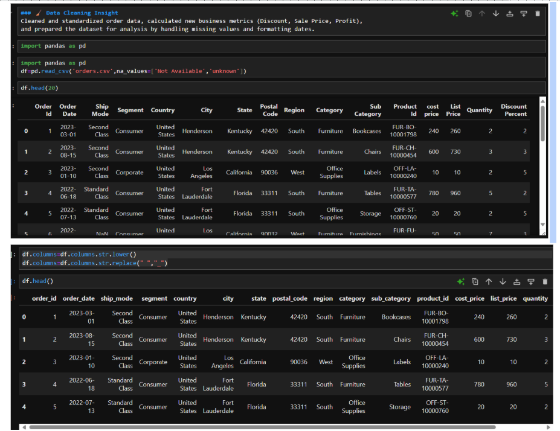

# order-data-analysis
Sales order analysis using Python, SQL, and Jupyter Notebook

# Order Data Analysis Project

This project analyzes sales order data using **Python (pandas)** and **SQL (MySQL)** inside a **Jupyter Notebook**.

## 🔧 Technologies Used
- Python (pandas)
- SQL (MySQL)
- Jupyter Notebook
- SQLAlchemy for database connection

## 📊 Key Business Questions Answered
- Top-selling products
- Month-over-month sales comparison (2022 vs 2023)
- Sub-category sales growth
- Region-wise top products

## 🧠 Data Insights
- February, April, and October 2023 saw strong sales growth
- June and August underperformed, indicating potential strategy gaps

## 📂 Files Included
- `order data analysis.ipynb` – Jupyter Notebook with code & analysis
- `orders.csv` – Cleaned dataset
- `sql_queris.sql` – All SQL queries used

## 🖼️ Screenshots
  ### 🖼️ Top 10 Selling Products

### 📈 Month-over-Month Sales Comparison

### Data Cleaning in Notebook

## 🙏 Credits
Project inspired by Ankit Bansal's YouTube tutorial.

